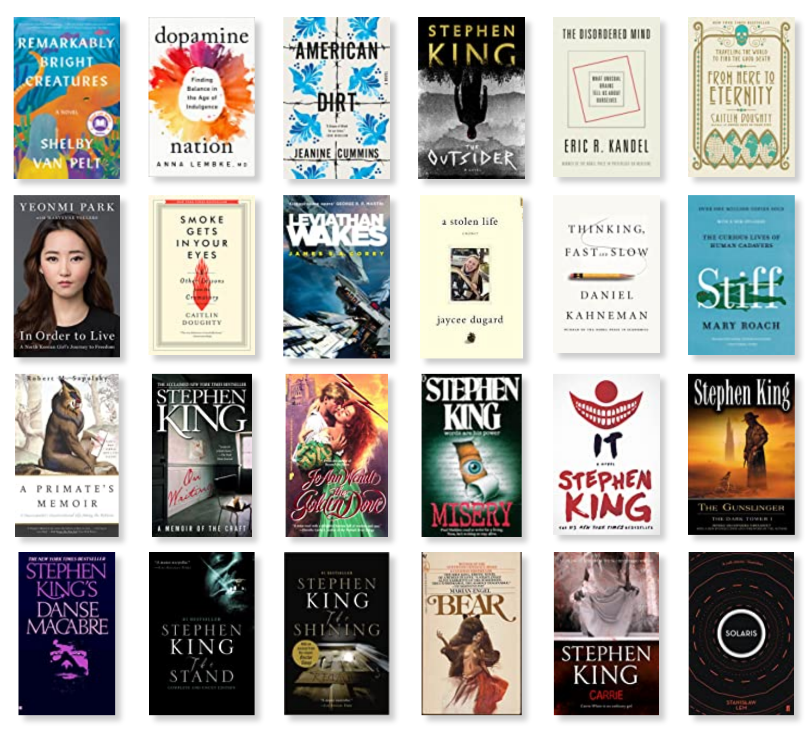

I get asked for book recommendations a lot, mostly by friends of mine who know I spend an inordinate amount of time reading. This year, I thought it would be nice to have a centralized place I could point people to. I would also like to take this as an opportunity to reflect on this year's readings and collate my thoughts on the books I've read. It's interesting to come back to them years later and notice how your thoughts on books evolve with your aging and shifts in perception - this way I'll have a snapshot of what I thought of them when I first read them, which will be like a brain photograph when I've well forgotten what I read this year. 

So, without further ado, let's talk books!

## The list

The image is ordered by the date of publication, not by any particular rating system. I will, however, share with you what I rated each book as. First, a quick explanation of my rating system - I use a 5-star rating system, where the different scores mean the following:

- 5 stars: these are the books that have not only taught me something, but that I feel like I will remember in ten years. I would wholeheartedly recommend books in this category to anyone who asks. If I had to build a library with the different books I've read over the years, the 5-star category of every year is what would populate it. 
- 4 stars: these are books that I thoroughly enjoyed reading and that I thought were above average, but that had at least one trait I disliked that hampered my enjoyment of them. For instance, an otherwise excellent book with an unsatisfying ending would fit here. 
- 3 stars: these are the books that I thought were pretty okay. There's nothing particularly wrong with them, and most of them do more than a couple of things right, but when it comes down to it they're not books I think I will remember for a long time. Think of them as the airport reads of this list.
- 2 stars: these are books that I don't regret reading, but would not read again and don't particularly recommend. They usually have more than one trait that bothered me and, overall, took a fair bit of forcing myself to continue reading to finish them. 
- 1 star: these are books that I had no fun reading and regret spending time with. It's rare for books to land themselves in this category - throughout my life only a handful of them have been such complete write-offs. This year, fortunately, I didn't rate any of the books I've read 1 star. 

## The books, ordered by rating

Here are the books in the above list ordered by their rating, descending:

- 5 stars: 
    - *It*, by Stephen King; 
    - *The Disordered Mind*, by Eric Kandel;
    - *In Order to Live*, by Yeonmi Park;
    - *Smoke Gets in Your Eyes: And Other Lessons from the Crematory*, by Caitlin Doughty;
- 4 stars: 
    - *Dopamine Nation: Finding Balance in the Age of Indulgence*, by Anna Lembke;
    - *The Stand*, by Stephen King;
    - *A Primate's Memoir*, by Robert Sapolsky;
    - *American Dirt*, by Jeanine Cummins;
    - *The Shining*, by Stephen King;
    - *On Writing*, by Stephen King;
- 3 stars: 
    - *Bear*, by Marian Engel;
    - *Solaris*, by Stanislaw Lem;
    - *Danse Macabre*, by Stephen King;
    - *From Here to Eternity*, by Caitlin Doughty;
    - *Thinking, Fast and Slow*, by Daniel Kahneman;
    - *The Outsider*, by Stephen King;
    - *Leviathan Wakes*, by James S.A. Corey;
    - *Remarkably Bright Creatures*, by Shelby Van Pelt
    - *Misery*, by Stephen King
- 2 stars: 
    - *A Stolen Life*, by Jaycee Lee Dugard;
    - *Stiff: The Curious Life of Human Cadavers*, by Mary Roach
    - *The Golden Dove*, by JoAnn Wendt
    - *Carrie*, by Stephen King
    - *The Dark Tower Volume 1: The Gunslinger*, by Stephen King

## Short Commentary on the books, by descending order of rating

***
***It*** was probably my favorite book that I read this year. You might notice by looking at my list that I went on a slight *Stephen King* binge. His body of work is vast and I like him enough as a writer to slowly work through his writings, which will take me several years to complete. You will also notice that many of my ratings for King's books vary wildly. I have read elsewhere on the internet that many people consider *The Stand* to be his best book, and a fair number of other people are in love with *The Dark Tower* series, but from what I've read so far *It* stands heads and shoulders above the rest. This is a long book, one that takes a fair amount of time to get going - but the other side of that coin is that there is time enough for deep characterization. Every single member of the Loser's Club captured my heart in one way or another - they are deep, intricate characters with rich internal lives, and at the heart of it I have found that to be a requirement for the horror. The time spent making sure you understand the inner lives of the main characters pays off immensely when Pennywise the clown starts ramping up the tension. 

This is also an excellent book on the border between childhood and adulthood. I don't want to say that it is that *in spite* of being a horror book, because that would imply horror books can't have reflective, literary value; that's something I definitely don't think. Speculative fiction is literature, full stop - and there are equally marvelous books in genres like horror as there are in the most pretentious literary fiction. I *am* saying this because I know people are sometimes dismissive of speculative fiction's literary value, and I hope that I can convince you to give this book a shot. ***It*** has things to say, and it says them with very enjoyable prose that had me at the edge of my seat (or peeking inside my closet for murder clowns) as often as it had me reflecting on lazy childhood afternoons. 
***

***The Disordered Mind*** was one of three non-fiction books that marked me this year. It's a thoroughly enjoyable trip through mental illness, written by a Nobel-prize-winning expert.  It is dense with information and scientific theory, but Kandel manages to present daunting topics in a perfectly easy-to-consume way. Where plenty of discourse around mental illness is mistifying even when well intended, this book shed light and knowledge on subjects I had no concrete understanding of. We all know what Alzheimer's disease is, but how many of us have even a cursory understanding of what it actually *is*? 

Above all, I found this to be a deeply hopeful book. That is perhaps strange commentary - there is nothing inherently hopeful about the details of mental illness or the science of brains. However, there is much deeply hopeful about *understanding*, and about the notion of progress. Kandel's work taught me many things, and the knowledge should not be sold short; but at the end of the day, what it really did was fill me with confidence in science, bring some monsters into the light, and tell me exactly how we're fighting them and how much we've achieved already. It's hard not to come out of reading it with renewed faith in human problem-solving. 
***

***In Order to Live***, by Yeonmi Park, gave me a window into a section of the world I'd never paused to consider. A surviving deserter from North Korea, Park describes her life there in excruciating detail and takes us with her through her escape. Trafficked, subjected to conditions and experiences that often forced me to pause and consider the gravity of them - "this is a real person", I had to keep reminding myself, "not a character in a tragic book. She really lived through this. People really live through this." - Park still manages to retain a wonderful sense of humor, a sharp mind, and thoughtful prose. 

This book is a sharp reminder of how lucky I am as a European, in so many ways - but it is also a triumphant tale of perseverance, the importance of education, and strength of character. 

I often avoid books with similar subject matters because I find that they revel a bit too much in their own misery. Park's story rivals the misery in all of them, but it is not a miserable book, nor is it oppressive or sad to read. The undercurrent of her strength makes this book revitalizing - in a way no book this dark ought to be.

***

***Smoke Gets in Your Eyes: And Other Lessons from the Crematory*** continues the trend of books that widened my perspective on a subject I had very little perspective on.

I'm afraid of Death. I've always been afraid of Death. The first time I read through *Harry Potter*, back when it was first getting released and I was a teenager growing up with the characters, I remember thinking: yeah, Voldemort sucks, but he's just trying not to *die*, man. That resonated with me on a deep level. The notion of wizards giving up the Philosopher's Stone still sounds like poppycock to me. 

*Smoke Gets in Your Eyes* was meant to be read by people like me. It argues that death is nothing to be afraid of, not a word to capitalize. It also sheds light on *why* we're afraid of it, in such a visceral way - what cultural undercurrents are at play here, what financial interests.

It tells the story of a mortician as she stumbles through her career in a crematory. It's endearing and relatable in a way that I didn't expect to relate to a 20-year-old woman in California who spends her days tending to corpses. It's a deeply personal story, but one that helped expose me more to the concept of death. It's the first book that took some of the edge off of the idea. I'm still scared of death, but now it's not a paralyzing fear - and now I can spot myself being scared, remember Doughty's writing, and feel a little bit less out of my depth. That's a gift only an excellent book can give you.

*** 

***Dopamine Nation*** resonated with me because I've been addicted before, and because I've interacted with people with addictions all my life. You can't be a top-performing video game player and practice for 16 hours a day without a degree of addiction. Throughout two years of my life, I lived and breathed video games - until I had to stop to regain control of my sanity. Going cold turkey for well over a month helped me return to a baseline I could work from, and from there I was able to come back and build a much healthier relationship with games. 

Now, whenever I feel the pull of addiction - be it from games, from refined sugars, from social media, or from something else entirely - I not only have my prior experience to draw from, but I have the theoretical tools to make sense of it, given to me by this book. Anna Lembke is the Chief of the Stanford Addiction Medicine Dual Diagnosis Clinic at Stanford University, and she outlines addiction in a non-judgmental, candid way, focused on ways to combat it and regain control. An ever more important book in a time where addiction science is more and more prevalent, masked by words like "user retention" and "marketing". 

***

***The Stand*** is King's take on the post-apocalyptic genre. I read the complete edition, which contains King's own selection of scenes that had previously been cut because of publication constraints. It is a long, meandering book with a tale of Good and Evil at its center. 

I should make the disclaimer that I'm not a big fan of the post-apocalyptic genre. I try to read widely in general, but I can count in the fingers of two hands the number of post-apocalyptic books I've read, and I'm not particularly interested in the subject matter at this time, even in other mediums. I'm not the biggest fan of the Fallouts or The Walking Deads of the world. 

The heart of it, I think, is that post-apocalyptic fiction always leaves a taste of missed opportunity in my mouth. I tend to like focused, character-driven stories where the plot isn't forgotten about, but it serves the characters. To put it bluntly, I tend to like stories about people, not about "happenings". 

By the very nature of the genre, post-apocalyptic fiction (as well as genres like cyberpunk) tends to fly a little too close to the "happening" for my tastes. The apocalypse is less of a backdrop for interesting reflections on how people behave (which would make for compelling storytelling), and more of a main character of its own, looming with its host of uninteresting questions, like *Why did this happen?* and *How could we have prevented this?* This, to an extent, is also a problem in *The Stand*. 

Why, then, did I place it at four stars? Was it just the sheer strength of King's writing?

Well, no. Not to disparage King, but that wasn't it at all. As I mentioned, I thought the book dragged at times, and there's no shortage of generic post-apocalypse trope characters in it.

To me, the book was saved by the character of Harold Lauder. I don't want to spoil too much, but Harold was a *very* interesting exploration of the type of person who is prone to atrocity in the post-apocalypse out of sheer bitterness. He was not misunderstood. He did not have a redemption arc. He chose his own damnation when he could have chosen redemption. I suppose the question of whether he could have *really* chosen redemption remains to be answered - I'm not even sure if Harold believed he could or not. Would he have been less morally reprehensible without the apocalypse? I am unsure. 

Over the months that followed my reading this book, the character of Harold has often come to me unprompted, and I have often thought about what his characterization, which strikes me as unabashedly *true*, means about *people*. That fact alone has made me rate this book as highly as I have. If every book I read contained at least one character written as honestly and nakedly as Harold Lauder, I would be a very happy reader indeed.

*** 

***A Primate's Memoir*** brings us back to non-fiction. This is a book about Robert Sapolsky's awkward years of entering academia, which have the added novelty of having been spent in a national park in Kanya amidst a hoard of baboons that Sapolsky would go on to study for 20 years. 

It is a book of passion and culture shock, a book that paints both Africa and academia in all their magic and allure, as well as in all their trappings and nonsense. I have only ever researched literature in my life, but I related to many of Sapolsky's frustrations with the academic world, as well as I related to many of his coming-of-age questions and thoughts about his place in the world. The book is human, and it does a good job of humanizing often glamorized research, without ever falling into the trap of doom and gloom.

On top of that, Sapolsky is a genuinely funny writer, and I found myself laughing at his prose on more than one occasion. There's very little here not to like. 
***

***American Dirt*** was one of the last books I read this year, and I described it to my partner as "an important read, and one that I never want to go through again".

The prose is solid, and the subject matter is as important as ever. The book follows Lydia and Luca, mother and son, as they attempt to escape the Mexican cartels and migrate north, to the United States, in search of safety and a better life.

It is a heavy, heavy book. But I feel like it will invariably come to my mind in every future discussion about migration and migration policy, and it will nudge me towards thinking of the migrants as individual people, each with their own rich, personal lives, their stories, their dreams, instead of as *the migrants*. 

That is, perhaps, an embarrassing reminder to need. But it is still one I'm happy to have, and one that I feel I will remember after reading this book. 

I am certain others could do with the same reminder.
***

***The Shining***, once again by Stephen King, is the last book on my list of 4 star-novels. 

It is hard to talk about *The Shining* without addressing the shadow of Kubrick's movie, so I will address it from the start: after reading this book, I feel like Kubrick's adaptation, while a technical marvel, entirely misses the point of the characterization and produces a worse end product for it.

Jack Torrance is no lunatic, as he was often portrayed to be in Kubrick's movie, slowly losing control of his mental faculties. Instead, *The Shining* is part exploration of what isolation can do to a man but, more pointedly, a tale of a *bad place* in the vein of Shirley Jackson's *The Haunting of Hill House*. Jack *honestly* wants to do better. His insecurities are plenty and his flaws outnumber them, but he is earnest in his love of his family and in his attempts to be good. Ultimately, it is the *Overlook Hotel* that breaks him, the *evil presence*. Up until the very last moment, Jack Torrance is *trying* to resist, with all the strength that's left in him.

Masterfully written, always tense, and fully believable, *The Shining* is an instant horror classic because it tells us that even good men can be pushed too far if they're pushed by something powerful enough. Few thoughts are more uncomfortable to linger on. 

***

I will have more complete thoughts on ***On Writing*** at a later date, namely when I finish my book. At the moment, most of its advice is too fresh and interwoven with practical thoughts that came to me while I was writing a scene or other. 

For now, suffice it to say I found it a worthwhile book that added a couple of tools to my toolbox. Recommended mostly for other writers.

***

Onto the 3-star novels, I shall give shorter commentary on them. You can assume that all of the books on this list are enjoyable enough to read, so I will limit myself to talking about what I enjoyed particularly in them, and what stopped them from being rated higher.

In ***Bear***, I enjoyed the depiction of the Canadian wilderness and the novelty of the subject matter. I have read criminally little Canadian literature, and while *Bear* isn't particularly Canadian in subject matter, the depictions of nature were distinctly so. There is nothing particularly *wrong* with this book, but it didn't do anything particularly *right*, either. 

***

In ***Solaris***, I liked the concept of a sentient ocean the most. The prose, unfortunately, was not the best, and it dragged nearly unforgivably on some of the research-centered chapters; but the book stands on the sheer strengths of its ideas. It is a book of concepts and abstractions - it trips whenever it tries to return to the concrete. 

***

In **Danse Macabre**, I genuinely enjoyed the passion dripping out of every page. At the same time, this is not a book for someone wanting to learn about horror from one of its masters; rather it is more of a book designed for people who already *know* horror. King bombards you with references, case studies, and comparisons that are overwhelming if you're dipping your toes into the genre - as I was. His passion is contagious, and I did get the urge to follow up on many of his recommendations; but the book did feel, at times, like one of those moments where you're just nodding along while an expert in their field rants about things you have no real understanding about. It will be very interesting to return to this book once I've read more horror.

***

***From Here to Eternity*** lacks the rawness that made *Smoke Gets in Your Eyes* resonate with me. Instead, this book is essentially a travel log, as Caitlin Doughty visits several countries to experience their death rites. It did give me many ideas for future holidays, and a reinforced appreciation for radically different cultures, but there were no epiphanies to be found here. Perhaps *Smoke Gets in Your Eyes* did too good a job at producing them, and there were none left for this one. 

***

***Thinking, Fast and Slow*** is a tragic book, in the sense that the author is an expert - a Nobel prize in economics - and, what's more, an expert who understands the importance of wording things in a way that sticks with readers. More than once, the author voices the intent to word things simply, knowing that anything less will result in a worse book. 
Unfortunately, I just do not believe there is enough material here for a whole book. About halfway through, I felt as if I was simply getting new anecdotes and case studies to reinforce points that had been made in the first half of the book. While useful, those were incapable of holding my attention for long. I finished the book, and it does contain some very useful insight in terms of noticing and addressing your own biases; it just could have done the same in around 200 fewer pages, as far as I'm concerned. 

***

***The Outsider*** is a perfectly fine Stephen King thriller. It does its job more than okay, subverting a traditional crime novel structure into a paranormal investigation elegantly. It's tense, a page-turner, and a good palate cleanser in between heavier reads. 

***

***Leviathan Wakes*** is the first book in The Expanse series, and it would have ranked higher if it wasn't for two things: first, James Holden is insufferable as a character and I rolled my eyes at his inner dialogue at an alarming rate. I don't think I agreed with any of the major decisions he made throughout the book, and I quickly got tired of his moralism-hidden-as-humility shtick. This might be intentional characterization, but it certainly made the book hard to stomach, at times. 

Second, I was relatively disappointed with the book's major plot twist. Not wanting to spoil things too much, I will just say I would've preferred if the book continued as it started out in the first half. Not every story needs to be high stakes, and this one felt like it hurt as soon as its scope broadened. 
I will, however, probably give the rest of the series a try at some point. I have to commend the credible and ingenious world-building, the interesting setting, Josephus Miller's character, and how that interesting take on the worldly noir detective transposed well into galactic drama. 

***

***Remarkably Right Creatures*** is a comfortable book about an old, lonely lady and an old, lonely octopus, who strike an unlikely friendship. Its prose is unexpectedly poignant at times, and some of the strong moments of the book are deftly executed. I have nothing overtly negative to say about it - it was an easy, enjoyable read.

***

***Misery***, by Stephen King, falls into the same category as the book that came immediately before. It's not a particularly polarizing book, in my eyes - rather it's a strong concept, executed competently, and an enjoyable enough read. It stands among the likes of *Gerald's Game* as a good King book that doesn't quite reach the heights of his best but doesn't do anything terribly wrong either. 

***

As for the two stars books, I don't enjoy being particularly negative, so suffice it to say I don't particularly recommend any of them. ***A Stolen Life*** struck me as the same kind of book as *In Order To Live*, but lacking Yeonmi Park's literary voice to sustain it. It felt more voyeuristic, and less of a narrative process. I sympathize with Jaycee Lee Dugard and wish her all the best, but it was not for me. 

In the same vein, ***Stiff: The Curious Lives of Human Cadavers*** also struck me as a different version of *Smoke Gets in Your Eyes* that I was less interested in than the original. Where Doughty's book focuses on the human questions surrounding death and the experiencing of death, Mary Roach only occasionally touches on those topics, focusing more, instead, on assorted factoids about what cadavers are useful for and what happens to them when they're donated to the medical sciences. Interesting in its own right, for the right kind of reader, and in a more encyclopedic sort of way - it just wasn't what I was looking for. 

***The Golden Dove*** is something I only read because it is an important book in my partner's history. It's a historical romance novel, with all their tropes and pitfalls. There are occasional moments of inspired prose, but there is an equal number of moments of *uninspired* prose. The titular character, Dove, is frustratingly pouty and childish in a way only romance protagonists can truly be. The book hinges on the complete inability of the two main characters to communicate effectively with each other. It always tickles me when romance novels depend almost entirely on emotional immaturity on the part of everyone involved. Don't get me wrong - that is a perfectly believable depiction of how some people would act in regard to their personal relationships. I just don't find it particularly enthralling to read about.

***Carrie*** is Stephen King's first book, and while there's nothing too egregiously wrong with it, I feel like it only contains the seeds of what would later become a very strong writer.  Other, more recent work of his hits many of the same notes, but with greater finesse and better execution. Besides sheer curiosity at his origins, there are many King books I would recommend before this one.

Finally, ***The Dark Tower Volume 1: The Gunslinger*** is a book that feels incomplete. Nothing in it is particularly bad, but by the end of it I knew very little about the gunslinger that is the titular character, and I struggle to feel invested in stories where there aren't characters for me to care about. Roland is, at least in this book, a very difficult character to care about, because he isn't much of a character to begin with. The focus of this book is very much on what is happening, and not on who it is happening to. 

I believe my problems with this book might be alleviated by delving further into ***The Dark Tower*** as a series, but that will have to wait for another year. 

***

## Closing thoughts on the year of books

My first instinct is to call this the year of horror, which is appropriate considering the current state of the world and the events we've all been through lately. Delving into a genre I was unfamiliar with, however, was anything but horrifying - in fact, it was refreshing. I can't wait to read more of the genre's classics and better understand what works and what doesn't. As with every genre I read, the perspective it has given me is fertile in every way. I suppose the fact that I enjoyed most of the books I read is just the cherry on top.

While the year was one of discovering horror, it's impossible not to notice that only one horror book made it into my top books of the year - the rest of the podium was taken up by non fiction. Because of that, I have to add a P.S. to the monicker of "The year of horror". This wasn't just the year of horror - it was also the year in which fictional horror was contrasted with real, living people and their courage, character, and life experiences - often facing very real horrors. 

So there it is - the year of contrast. It was certainly cathartic in a strange way to read so much horror in such a strange year; but the books were, ultimately, comforting, and they left me feeling fuller than when I began. 

As reading always does. 

## A sneak peek

If you made it all this way, I couldn't leave without giving you a sneak peak into things to come. I've been radio silent about my book lately, but rest assured that has been because I've been working on actually writing it. 

I will announce the beta-reading stage of the process and share how you can sign up to beta-read my work before the end of the year. The manuscript will go out to beta readers in Q1 2023. 

See you then! 