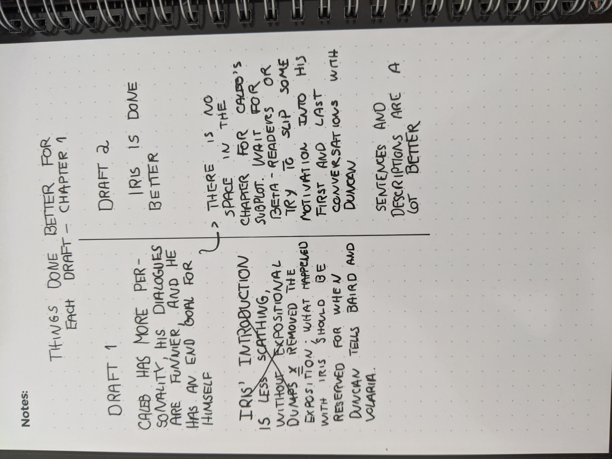
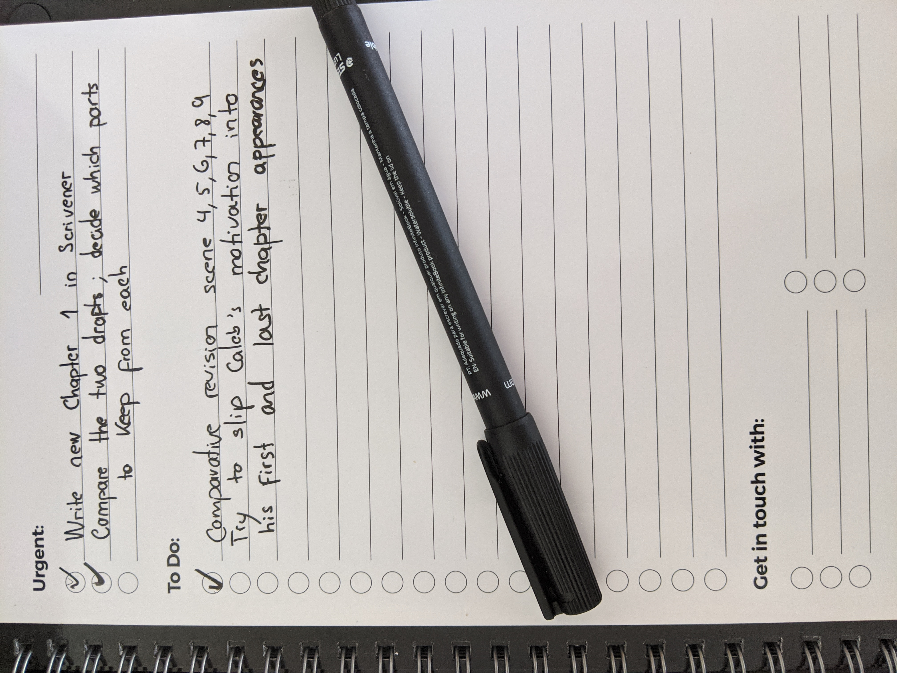

It's becoming a bit of a habit to miss my word count goals with the second draft process, which indicates one of two things: I'm setting goals that are too lofty, or I'm not giving enough of my time to the book. I recently spent some time thinking about which one it was, and I came to the conclusion that quarantine has sort of been affecting my productivity more than I had expected. My energy levels have been down a bit, and while I still produced thousands of words I'm happy with, this is not a rhythm that will allow my book to be ready still in 2020, which was always my goal. Therefore, my only course of action is to increase the amount of time I spend revising to meet my self-imposed deadline. 

I am still committed to having the book ready until the end of the year. It's moving along, if a bit slower than expected. For word count updates, jump to the bottom of this article.

## Changing things doesn't always mean they get better

At some point in every creative endeavor, further revising starts bringing diminishing returns. Even the best writers can always find some flaw with their manuscripts after they've been edited and re-edited, gone through revisions multiple times, and thought over to exhaustion. One might even say all this revision can sometimes harm the writing itself: Ernest Hemingway wrote tens of possible endings to *A Farewell to Arms*, and many people prefer some of the endings he left out to the one he ended up choosing. 

This month, I wrapped up the revision of the first chapter of my book. I talked last month about how I'd reworked some things to make exposition flow more naturally into the story, and most of those changes have survived. But when faced with the end product of my revision, I was also taken by the urge to revise it again. It makes sense, right? If you revise the writing, surely it makes sense to also revise the rewriting. And then revise that revision. 

Obviously, if I did this, I would never write an actual book.

To appease my inner editor, I came up with some practical compromises. One, I decided I would not revise my revisions. I've laid out a plan of what I think the editing process for this book will be - first a passthrough to fix plot and thematic coherence, add and remove scenes, rework what characters do at times; then a stylistic passthrough where I fix sentence construction and pretty everything up; then send it out to beta readers and change things based on their feedback; finally, the book will be done. I'm comitted to sticking to this plan, if nothing else to figure out how effective it actually is. I'll introduce changes only after it's had a chance to run its course, as I believe that's the only way I'll be able to identify possible shortcomings.

Two, because the above got my inner perfectionist screaming, I read both drafts of the chapter again, and I wrote up a list of things each of them did better than the other. For the sake of science, I will share a picture of that list below, as I wrote it on my notebook (yes, I write things in paper. A lot. It helps me slow down my mind and think through what I'm writing, whereas on the computer I type too fast for my brain to keep up). 

Then I went through the things I thought the first draft did better, and I attempted to transfer them into the second draft. The exercise was suprising, in a sense, as some distance from the first draft allowed me to realize there were actually things it did quite well, and I didn't want to do away with them. By taking the time to make sure they're present in the second draft as well, I ensured that the second draft is a marked improvement over the first one (containing the same qualities, plus some improvements). The downside is that this took a fair bit longer than just taking the second draft as immediately better. 

Here's how my To Do list in my trusted notebook looked at one point: 

All in all, the exercise was effective in quieting my inner editor, though. Having a tangible sense of the ways in which the second draft was better than its previous iteration comforted me, and made me feel like I was moving in the right direction. Of course, there are still a thousand ways I see of rewriting the chapter, but if I explored each and every one of them to try and figure out the best, I would take years just to be done with this first section. I am happy with the improvements I've made, and with the chapter's state in general after the first revision process. If I was asked by a shareholder to defend my product, I could give good reasons for why I chose to write it the way I did. For now, and considering that I won't have an accurate picture of how this is perceived by readers until later in the whole process, my satisfaction will have to be enough. And frankly, it should be: what kind of book would this be if its own author, at least, didn't think it was good? 😊

## Current state of things

**Current word count**: 24.874 thousand words (second draft).

**August goal**: Go up to 35 to 40 thousand words in the second draft.