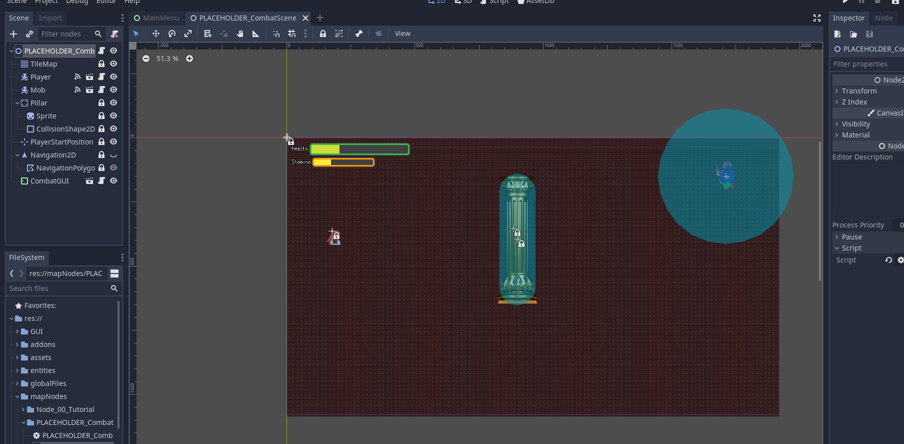
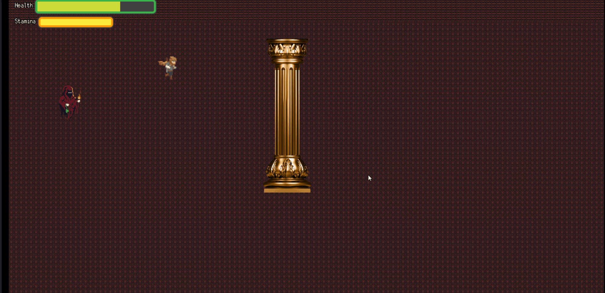

Last month I said I was iterating on gameplay loops to try and find something that works for the game while I grind away at the book. This month I will do my first actual implementation overview, and sort of go through the challenges of implementing the sort of 2D combat that you see traditionally in a lot of indie games. 

## Responsibility 

The game is being developed on Godot Engine, and Godot uses the concept of a [scene tree.](https://docs.godotengine.org/en/stable/getting_started/step_by_step/godot_design_philosophy.html) Understanding Godot's design philosophy is extremely important to make sure things work properly in the end and you can assemble the different blocks in a single scene without everything being very cumbersome to change. From my understanding of it, the design rules for designing a game's scenes are very similar to the design rules for designing, say, APIs. One of the most important questions you'll have to answer in both is what the responsibilities are for specific classes. Generally speaking, in software, it's a good idea to follow the *Single Responsibility Principle* (SRP). According to Wikipedia, the SRP states that:

`every module or class should have responsibility over a single part of the functionality provided by the software, and that responsibility should be entirely encapsulated by the class, module or function.`

This is just a fancy way of saying that your classes should do one thing, and one thing alone. 

In Godot, the Scene's responsibility is that of *orchestrating* everything else. So, for a combat scenario where you have a character fighting a monster, the character and the monster handle themselves. They know when they get hit, when they're supposed to change their animation, and in general can behave without input from other classes. But the scene is what controls everything they don't know themselves; for instance, the GUI, their relative positions, and whatever information they need to react to that they don't have in their own class.

With that in mind, let's check what the composition was for the scene that I assembled containing the proof of concept for 2D combat.



You can see there are four main components in the scene: the player character, a monster (here represented by a nice little ghost), an obstacle in the form of a pillar, and the GUI controlling the player's health and stamina.

Keeping in line with what I mentioned before, let's look at what the code looks like in the actual scene's file.

```python
func _ready():
	$Player.start($PlayerStartPosition.position, true)
	$Mob.start($PlayerStartPosition.position)
	$CombatGUI.updateHealth(100);
	$CombatGUI.updateStamina(100);
	
func _on_Mob_shoot(bullet, pos):
	## Spawns the bullet, makes it move, and rotates it to move towards the player.
	var b = bullet.instance();
	add_child(b);
	var dir = Vector2(-1,0).rotated($Mob.position.angle_to_point($Player.global_position));
	b.start(pos, dir);

func _on_Player_update_Healthbar(health):
	$CombatGUI.updateHealth(health);
```
<p>

There are three things here: first, the ready function, that starts the whole scene. It spawns the player at a particular position, does the same for the mob, and sets the GUI to show full health and stamina. The player and the mob both control their own health - it wouldn't make any sense for the scene orchestrating them to control it. But it does make sense for the scene to orchestrate the GUI to match the player's health, and since the player class always spawns the player at full health and stamina when instanced, we can just set the GUI to show full health and stamina. In a full production level, we could make the scene set the GUI values to `$Player.currentHealth` instead of 100.

The second function is `on_Mob_shoot`. You might be wondering why spawning the bullet that the monster shoots is the responsibility of the scene, and not the responsibility of the monster. The easy reply is that the monster class doesn't have all the information required to spawn the bullet itself. The bullet needs to be spawned pointing towards the player character's position, and the monster has no idea what the player character's position is. Besides, the monster has to spawn the bullet in a specific position in the actual scene, and the only class that can do that is the scene itself. If the monster is the child of the scene, and the bullet is a child of the scene too - one that will exist and behave independently of the monster - then the bullet needs to be a child of the scene as well, and not a child of the monster.

Lastly, there is `_on_Player_update_Healthbar`. This function, like the last one, is a signal - meaning it triggers when something else happens that emits the signal this function is listening for. In this case, the trigger would be the player's health updating. If the player knows that it got shot, and updates his own health accordingly, then the scene, that has control of the GUI, should make sure the GUI reflects the update in the player's health. If we were doing stamina management as well, there should be another function listening in for when the player updates his own stamina. However, for the proof of concept, there is still no stamina management implemented.

I won't give a detailed look into the Player class in this game, mainly because I feel like it deserves a blog post of its own in the future. In rough terms, the Player class takes input from the user and can move and attack. Besides that, it can take damage, and it will die if it takes too much of it.

I will, however, go into a big challenge that I found when implementing the Monster class: pathfinding, or enemy AI in general.

## Pathfinding AI

The basic behavior I wanted from the monster was that it would chase the player around and shoot it whenever it got close enough. This was mostly easy to implement, except for one thing: pathfinding. Remember the pillar in the middle of the scene? Making the monster move in a straight line towards the player was easy enough, but making the monster calculate the best possible path if the player hid behind a pillar was actually very challenging. 

Let's get right into it. This is how things ended up looking:

```python
	
func _process(delta):
	if mobHealth <= 0:
		queue_free();
	
	if stopMoving: 
		return;
	# The start position for the pathfinding is the mob's current position.
	# The goal position for the pathfinding is the player's current position.
	
	startPosition = position
	endPosition = player.position
	if(player.position.x > position.x): 
		$ProperAnimation.flip_h = true;
	else:
		$ProperAnimation.flip_h = false;
	_update_path()
	if path.size() > 1:
		var to_walk = delta * speed
		while to_walk > 0 and path.size() >= 2:
			var pfrom = path[path.size() - 1]
			var pto = path[path.size() - 2]
			var d = pfrom.distance_to(pto)
			if d <= to_walk:
				path.remove(path.size() - 1)
				to_walk -= d
			else:
				path[path.size() - 1] = pfrom.linear_interpolate(pto, to_walk/d)
				to_walk = 0
		
		var atpos = path[path.size() - 1]
		position = atpos
		
		if path.size() < 2:
			path = []
			set_process(false)
	else:
		set_process(false)
	
## Calculates a new path using the available Navigation 2D node. The startPosition and endPosition are updated every frame on the process function.
	
func _update_path():
	var p = navigation.get_simple_path(startPosition, endPosition, true)
	path = Array(p) # PoolVector2Array too complex to use, convert to regular array
	path.invert()
	set_process(true)
```

Oof, that's a lot to unpack.

First off, the `_process` function. This is a function that runs on every frame that the game renders. It's useful for things that need to constantly be recalculated, like, for instance, what the best path to take is.

The first thing we do is check if the mob should be moving or not. This is a simple flag to add that can save a lot of computation later. If the mob shouldn't be moving, there is no need to do any path calculation whatsoever, so we can make sure we're not using any processing power doing that if the flag says it's not needed. 

Then, we determine where the monster needs to move from, and where it needs to move to. It needs to go from where it currently is (that's the start position) to where the player is at the time of the calculation (that's the end position).

What follows is a simple animation check to deal with the sprites. If the player is to the left of the monster, we need to make sure the sprite is facing left. If the player is to the right of the monster, we need to make sure the sprite is facing right. Otherwise, the monster would look like it's moonwalking towards the player sometimes. It's a ghost, but it has no eyes on its back! 

Then, we jump to the `updatePath()` function. This was the saving grace of my development process. I tried for hours to find a way to algorithmically calculate what the best way to dodge a specific obstacle would be for the monster. Among other things, I tried:

- Having collision boxes on the obstacles and the monster. When the monster met an object, it would calculate the distance it was between itself and the top and the bottom of the obstacle, then it would try to go around it through the shortest possible path. This didn't work very well for situations where there were multiple obstacles: the monster would try to go around one, then bump into another, try to go around that one, and end up moving away from the player instead of taking a different path that was a bit longer but allowed it to actually chase its prey.
- Having the monster hit the obstacles at a slight angle. This way, it would sort of slide off the pillar and eventually be able to move around it before continuing to chase the player in a straight line. This also didn't work great with multiple obstacles, because then the monster could easily get stuck if there was no place it could slide to.

That's when I found out about [Navigation2D.](https://docs.godotengine.org/en/stable/classes/class_navigation2d.html). It turns out Godot already provided the functionality of pathfinding I wanted to implement: all I needed to do was create a Navigation2D node and declare what the "walkable" area of the scene was. Any area outside that wouldn't be considered valid for pathfinding purposes, making the monster path around it. I added a Navigation2D that excluded the pillar, and made the monster update its own path by checking that node instead of trying to calculate it programatically. The `update_path` function then returns an array of points the monster would have to move to in sequence in order to reach the player.

The rest of the process function just executes on that array, by moving to each point in sequence while there are points to move to. This movement can now be in a straight line, because the points themselves will already illustrate the path that the monster needs to move around. If there aren't any points left to move to, the monster just stops moving. There is a collision box checking when it is close enough to the player and toggling the "stop moving" flag when the monster is close enough to shoot, so the monster never actually runs out of path to follow; what happens is that when it gets close enough, it stops processing the path. When the player leaves the monster's range, the flag gets toggled, and the monster begins processing the path again on every frame. 

Here's what it looks like in motion:



## Back to responsibility

If you were paying attention, you might have noticed the reason I had the bullets be spawned by the scene itself, instead of by the monster, is that the monster should have no idea what the relative position of the player is. But in my implementation of the moving algorithm, I use the player's current position as the end position for the monster's `_process` function! 

You would be right to notice this. This is, in fact, a good indication that calculating the path should be a responsibility of the scene. Most likely, the monster should only have a function named `move()` that receives an array of positions, and executes on it; while calculating the content of that array of positions should be done by the scene, because it has all the information required to do so, whereas the monster shouldn't. Imagine we wanted to spawn a monster in a scene with no player: the way things are implemented above, we'd have to create a new Monster implementation, because it would break when trying to use the player's end position. 

For the purposes of the proof of concept, I decided not to change this, and to let it live as a reminder of how proper design often comes from iteration. If I was developing the actual end product, that would be a necessary change going forward. For now, I think it's more important for me to start looking at other aspects of the game, and to polish the design of whatever gameplay loop I end up going with in the end.

## Acknowledgement

Most of the assets you see in the proof of concept are free assets I'm using for mocking purposes, and they come from itch.io. You can find several free asset packs to work with there, although most of them require crediting if you end up using them in your end products.

## What's next?

Next month I'll either write a new blog post on the implementation of another core system or, if I make any progress on the proof of concept for other gameplay loops, outline those, much like I did here for 2D combat. As usual, the development of the game is somewhat slowed, as the book takes precedence this year.

If you have any questions, comments or feedback, feel free to reach out to me through any of the channels I make available in the About page; and if you want to give a more in-depth look to the code, you can check my github, linked in the footer. Bear in mind all of this details my journey in self-teaching both Godot and game development, so I'm sure some of the ways I handle things are not optimal. It's part of the learning process.